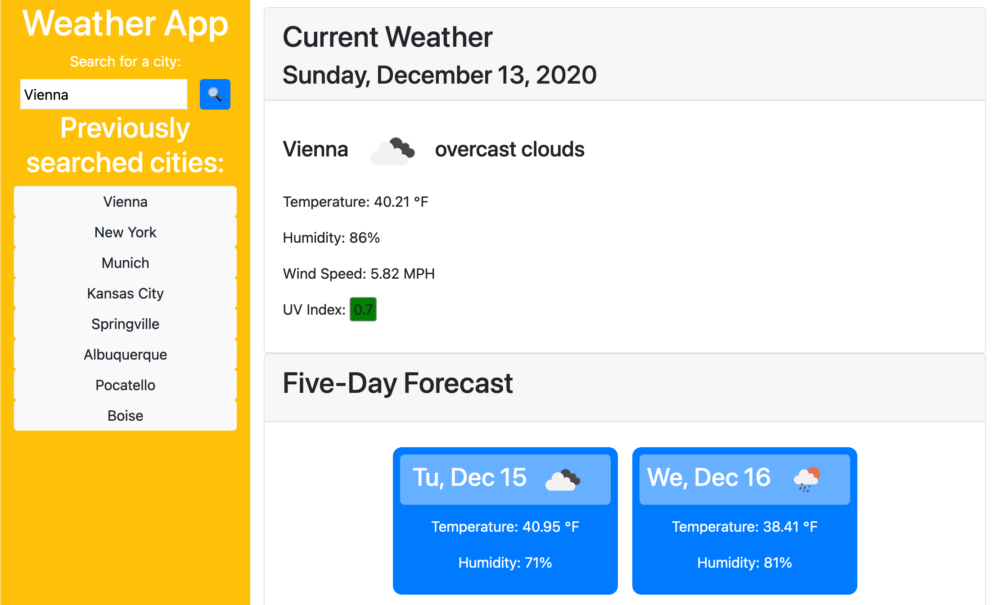

# weather-app

This is a straightforward weather app that uses data from openweathermap.org's API.

The data for the page is obtained from three separate API requests. The first delivers current weather data for the selected location. The second carries UV index data for the location, which is not contained in the first API's data. Finally, the third API holds a seven-day forecast.

The second and third API requests are dependent on the first. The current weather API accepts a city name for its query, whereas the UV index and forecast APIs do not and only accepts latitude and longitude values. However, the current weather API returns those coordinates for the searched city, which is then in turned used to fetch the UV index and forecast. Thus, all three API requests are chained together for proper functionality.

Once the weather data is obtained, the script's purpose is primarily to write the appropriate data to the page. Additionally, the last 10 searches are saved to localStorage and displayed in buttons within the `<nav>` element. Day.js (as an alternative to moment.js) is used to handle dates and Unix timestamps given in the API data. Bootstrap is used for responsive layout.

https://github.com/gavin-asay/weather-app

https://gavin-asay.github.io/weather-app/

